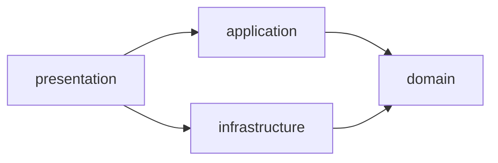
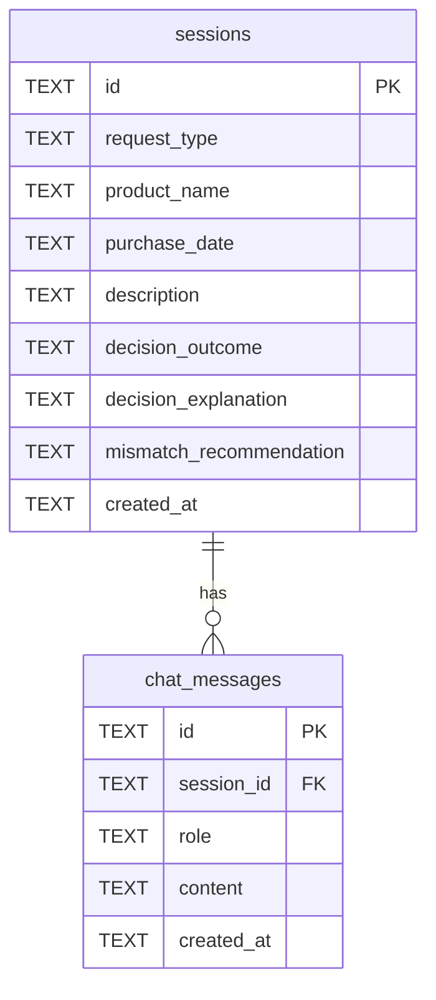
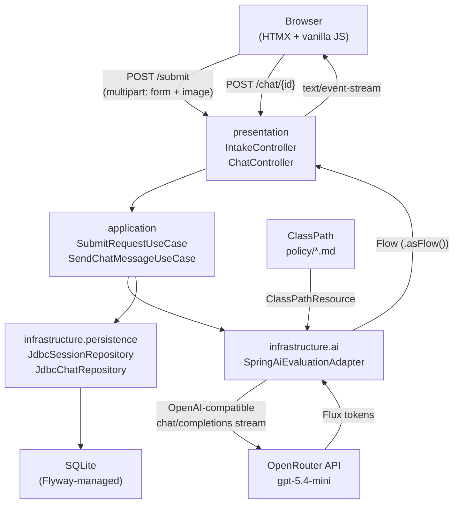
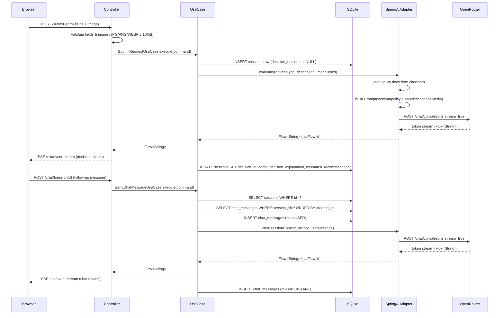
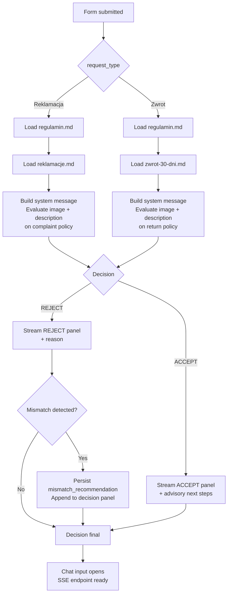

# ADR-001 — AI Complaint & Return Chat: Architecture

**Status**: Accepted
**Date**: 2026-03-26

---

## Context

The system is an advisory-only AI chat for Sinsay customers to submit a complaint (Reklamacja) or return (Zwrot) request, receive a multimodal LLM decision, and ask follow-up questions in Polish. Key constraints from the PRD:

- Polish language only; no backend integration
- Image upload is mandatory for every submission
- Policy document routing is deterministic (per request type)
- Decision must render in under 30 s for 95% of sessions
- MVP scope: single product per session, no authentication

Credentials are stored in [`.env`](../.env) (OpenRouter API key and base URL).

---

## Decision

### Technology Stack

| Layer | Choice | Rationale |
|---|---|---|
| Language | Kotlin (JVM) | Concise, null-safe, first-class Spring support |
| Framework | Spring Boot 3.x + WebFlux — standalone fat JAR | Reactive, non-blocking stack; embedded Reactor Netty (WebFlux default); controllers use Kotlin coroutines and `Flow<T>`; no extra server configuration needed |
| AI integration | Spring AI → OpenRouter (`openai/gpt-5.4-mini`) | OpenAI-compatible client; multimodal Media API; streaming via `Flux` converted to `Flow` with `.asFlow()` |
| UI templating | kotlinx.html DSL | Type-safe HTML from Kotlin, no template language context-switch |
| UI interactivity | HTMX 2.x + vanilla JS | Form submission, SSE chat streaming, file preview — no build step required |
| Persistence | SQLite via Spring JDBC | Zero-setup embedded database; sufficient for single-node MVP session history |
| Schema migrations | Flyway | Versioned migrations (`V1__init.sql`); safe schema evolution without manual SQL |
| Build | Gradle 8.x (Kotlin DSL) via Gradle wrapper (`./gradlew`) | Consistent with Kotlin ecosystem; typed build scripts; wrapper ensures reproducible builds without a local Gradle installation |

---

### Project Structure

Single Gradle module. Clean architecture enforced by package convention — inner layers must not import from outer layers.

```
project-root/
├── build.gradle.kts
├── settings.gradle.kts
├── gradle/wrapper/
├── .env
├── docs/
│   ├── PRD.md
│   ├── ADR.md
│   ├── regulamin.md
│   ├── reklamacje.md
│   └── zwrot-30-dni.md
└── src/
    ├── main/
    │   ├── kotlin/com/lppsa/
    │   │   ├── SinsayApplication.kt
    │   │   │
    │   │   ├── domain/                        # pure Kotlin — no Spring, no JDBC, no AI
    │   │   │   ├── model/
    │   │   │   │   ├── Session.kt             # aggregate root
    │   │   │   │   ├── ChatMessage.kt
    │   │   │   │   ├── Decision.kt            # sealed class: Accept / Reject
    │   │   │   │   └── RequestType.kt         # enum: REKLAMACJA, ZWROT
    │   │   │   └── port/                      # interfaces (driven & driving ports)
    │   │   │       ├── SessionRepository.kt
    │   │   │       ├── ChatRepository.kt
    │   │   │       └── EvaluationPort.kt      # streaming evaluation contract
    │   │   │
    │   │   ├── application/                   # orchestration — depends on domain only
    │   │   │   └── usecase/
    │   │   │       ├── SubmitRequestUseCase.kt
    │   │   │       └── SendChatMessageUseCase.kt
    │   │   │
    │   │   ├── infrastructure/                # adapters — implements domain ports
    │   │   │   ├── ai/
    │   │   │   │   └── SpringAiEvaluationAdapter.kt   # implements EvaluationPort
    │   │   │   ├── persistence/
    │   │   │   │   ├── JdbcSessionRepository.kt       # implements SessionRepository
    │   │   │   │   └── JdbcChatRepository.kt          # implements ChatRepository
    │   │   │   └── config/
    │   │   │       └── AiConfig.kt            # ChatClient bean, policy loader
    │   │   │
    │   │   └── presentation/                  # HTTP layer — depends on application
    │   │       ├── web/
    │   │       │   ├── IntakeController.kt    # POST /submit → SSE stream
    │   │       │   └── ChatController.kt      # POST /chat/{id} → SSE stream
    │   │       └── html/
    │   │           ├── Layout.kt              # kotlinx.html base page shell
    │   │           ├── IntakePage.kt          # intake form rendering
    │   │           └── DecisionPanel.kt       # ACCEPT/REJECT panel + chat UI
    │   │
    │   └── resources/
    │       ├── application.properties
    │       ├── db/migration/
    │       │   └── V1__init.sql               # Flyway baseline migration
    │       ├── static/js/
    │       │   └── upload-preview.js          # file type/size validation + preview
    │       └── policy/                        # policy docs loaded as ClassPathResource
    │           ├── regulamin.md
    │           ├── reklamacje.md
    │           └── zwrot-30-dni.md
    │
    └── test/kotlin/com/lppsa/
        ├── application/
        │   ├── SubmitRequestUseCaseTest.kt
        │   └── SendChatMessageUseCaseTest.kt
        ├── infrastructure/
        │   ├── JdbcSessionRepositoryTest.kt
        │   └── SpringAiEvaluationAdapterTest.kt
        └── e2e/                               # E2E tests — Playwright Java + JUnit 5
            ├── IntakeFlowE2ETest.kt
            └── ChatFlowE2ETest.kt
```

**Dependency rule** (enforced by convention, not build isolation):

```
presentation → application → domain ← infrastructure
```

`infrastructure` implements `domain.port` interfaces. `domain` has zero external imports.



---

### Spring AI + OpenRouter Configuration

Spring AI's OpenAI client accepts any OpenAI-compatible endpoint. Configuration via `application.properties`:

```properties
spring.ai.openai.base-url=https://openrouter.ai/api/v1
spring.ai.openai.api-key=${OPENROUTER_API_KEY}
spring.ai.openai.chat.options.model=openai/gpt-5.4-mini
```

`OPENROUTER_API_KEY` is loaded from [`.env`](../.env).

---

### Image Handling

User uploads an image via multipart form. Server reads bytes, wraps in a Spring AI `Media` object, passes it inline with the user message — no storage:

```kotlin
val media = Media(MimeTypeUtils.IMAGE_JPEG, imageBytes.toResource())
val userMessage = UserMessage.builder()
    .text(prompt)
    .media(media)
    .build()
```

Image bytes are discarded after the LLM call completes.

---

### Policy Document Routing

Routing is deterministic at request time — the agent must never load both documents in the same session:

| Request type | System context loaded |
|---|---|
| Reklamacja | `policy/regulamin.md` + `policy/reklamacje.md` |
| Zwrot | `policy/regulamin.md` + `policy/zwrot-30-dni.md` |

Documents are `ClassPathResource` files concatenated into the system message in `AiConfig.kt`.

---

### Streaming

Spring AI `ChatClient.stream().content()` returns a `Flux<String>`. This is converted to a Kotlin `Flow<String>` with `.asFlow()` (from `kotlinx-coroutines-reactor`). Spring WebFlux handles `Flow` return types natively — no Reactor operators needed anywhere in application code.

```kotlin
// infrastructure/ai/SpringAiEvaluationAdapter.kt
fun evaluate(...): Flow<String> =
    chatClient.prompt(prompt).stream().content().asFlow()

// presentation/web/IntakeController.kt
@PostMapping("/submit", produces = [MediaType.TEXT_EVENT_STREAM_VALUE])
fun submit(@ModelAttribute cmd: SubmitCommand): Flow<String> =
    submitRequestUseCase.execute(cmd)
```

The `kotlinx-coroutines-reactor` bridge is included automatically by `spring-boot-starter-webflux` when the Kotlin plugin is present — no extra dependency declaration needed.

HTMX SSE connects and appends tokens in real time:

```html
<div hx-ext="sse" sse-connect="/api/stream/{sessionId}" sse-swap="token">
  <!-- token chunks appended here -->
</div>
```

---

### E2E Testing

E2E tests use the **Playwright Java library** (`com.microsoft.playwright:playwright`) wired into **JUnit 5 + Spring Boot Test** — no standalone Playwright scripts or CLI commands.

```kotlin
// testImplementation in build.gradle.kts
testImplementation("com.microsoft.playwright:playwright:1.51.0")
```

Each E2E test class:
- Annotates with `@SpringBootTest(webEnvironment = SpringBootTest.WebEnvironment.DEFINED_PORT)` to start the real server on port 8080
- Manages `Playwright` / `Browser` in `@BeforeAll` / `@AfterAll` companions
- Creates a fresh `Page` per test in `@BeforeEach`
- Lives under `src/test/kotlin/com/lppsa/e2e/`
- Runs as part of the standard `./gradlew test` task

---

### Database Schema

Managed by Flyway. Migration file: `src/main/resources/db/migration/V1__init.sql`.

```sql
-- Sessions: one row per form submission
CREATE TABLE sessions (
    id                       TEXT PRIMARY KEY,          -- UUID v4
    request_type             TEXT NOT NULL              -- 'REKLAMACJA' | 'ZWROT'
                             CHECK (request_type IN ('REKLAMACJA', 'ZWROT')),
    product_name             TEXT NOT NULL,
    purchase_date            TEXT NOT NULL,             -- ISO-8601: 'YYYY-MM-DD'
    description              TEXT NOT NULL,
    decision_outcome         TEXT                       -- NULL until evaluated
                             CHECK (decision_outcome IN ('ACCEPT', 'REJECT')),
    decision_explanation     TEXT,                      -- Polish plain-language explanation (≤200 words)
    mismatch_recommendation  TEXT,                      -- populated when request type mismatch detected
    created_at               TEXT NOT NULL DEFAULT (datetime('now'))
);

-- Chat messages: follow-up Q&A after the initial decision
CREATE TABLE chat_messages (
    id          TEXT PRIMARY KEY,                       -- UUID v4
    session_id  TEXT NOT NULL
                REFERENCES sessions(id) ON DELETE CASCADE,
    role        TEXT NOT NULL CHECK (role IN ('USER', 'ASSISTANT')),
    content     TEXT NOT NULL,
    created_at  TEXT NOT NULL DEFAULT (datetime('now'))
);

CREATE INDEX idx_chat_messages_session ON chat_messages (session_id, created_at);
```

**Notes:**
- `sessions.decision_outcome` is `NULL` during streaming; updated atomically when the stream completes.
- System messages (policy docs) are **not stored** — they are rebuilt from classpath on every LLM call.
- The initial evaluation prompt is reconstructed from `sessions.description` + metadata; the decision is injected as the first `ASSISTANT` turn when building follow-up context.
- `mismatch_recommendation` is populated when the agent detects a Reklamacja/Zwrot type mismatch (AC-14).

**Entity relationships:**



---

## Architecture Overview



---

## Request Flow



---

## Document Routing Detail



---

## Rejected Alternatives

| Alternative | Reason rejected |
|---|---|
| Spring MVC + embedded Tomcat | Blocking I/O; each SSE connection holds a thread; streaming requires extra configuration in servlet containers |
| Jetty (as WebFlux server) | Requires explicit Netty exclusion and extra dependency; no functional benefit over the default for this use case — unnecessary complexity |
| Reactor `Flux`/`Mono` in application code | Steeper learning curve than Kotlin coroutines for a Kotlin-first team; operator chains (`flatMap`, `switchMap`, backpressure) are harder to reason about than sequential coroutine code; `Flux` is still used at the Spring AI adapter boundary but converted immediately to `Flow` |
| Thymeleaf for templating | Extra template files; less type safety than kotlinx.html in Kotlin |
| React / Vue for frontend | Build pipeline overhead; overkill for server-driven UI |
| PostgreSQL | Requires external process; SQLite is sufficient for single-node MVP |
| Batch (non-streaming) responses | 30 s latency requirement; streaming improves perceived speed significantly |
| Direct Anthropic / OpenAI SDK | Spring AI abstracts provider switching; consistent multimodal API |
| Store image in filesystem or DB | Unnecessary for advisory-only system; reduces data retention surface |
| `schema.sql` on classpath | No migration versioning; Flyway enables safe schema evolution as MVP grows |
| Multi-module Gradle | Enforce CA at build level, but overhead is disproportionate for single-team MVP |

---

## Consequences

**Positive**
- Fat JAR deployment is simple (`java -jar app.jar`); no server config needed
- Spring WebFlux + Reactor Netty is fully non-blocking out of the box; SSE streams hold no threads while awaiting LLM tokens
- Kotlin `Flow` + coroutines keeps all application code idiomatic Kotlin; `Flux` is confined to the single `.asFlow()` call at the Spring AI boundary
- Spring AI abstracts OpenRouter — model or provider can be swapped via config only
- HTMX SSE delivers real-time feel without a JS build step
- SQLite requires no separate database process for MVP
- Flyway migrations allow schema changes to be tracked and applied safely
- Clean architecture by package makes layer responsibilities explicit without multi-module overhead

**Negative / risks**
- Kotlin coroutines/`Flow` still require understanding of suspend functions and structured concurrency — but the learning curve is lower than Reactor `Flux`/`Mono` for a Kotlin team
- Spring JDBC (blocking) used inside a reactive stack requires offloading to a scheduler (`Schedulers.boundedElastic()`) to avoid blocking the event loop
- SQLite is single-writer; concurrent sessions may queue on writes (acceptable for MVP load)
- `openai/gpt-5.4-mini` must support vision — verify on OpenRouter before launch
- kotlinx.html has limited documentation; team must be comfortable with Kotlin DSL
- CA by package convention relies on team discipline; no build-level enforcement

---

## Project Initialisation

Generate the skeleton using the [Spring Initializr](https://start.spring.io) REST API. The command below creates a Gradle/Kotlin project with the core Spring dependencies; Spring AI, SQLite JDBC driver, and kotlinx.html are added manually to `build.gradle.kts` afterwards (they are not available in the Initializr catalogue).

```bash
curl https://start.spring.io/starter.zip \
  --output sinsay-returns-bot.zip \
  -d type=gradle-project-kotlin \
  -d language=kotlin \
  -d bootVersion=3.4.4 \
  -d groupId=com.lppsa \
  -d artifactId=sinsay-returns-bot \
  -d name=SinsayReturnsBot \
  -d packageName=com.lppsa \
  -d javaVersion=21 \
  -d dependencies=webflux,data-jdbc,flyway

unzip sinsay-returns-bot.zip -d sinsay-returns-bot
cd sinsay-returns-bot
```

After unzipping, add the remaining dependencies in `build.gradle.kts` (`webflux` from the Initializr already pulls in Reactor Netty — no server configuration needed):

```kotlin
// build.gradle.kts (additions)
dependencies {
    // Spring AI (BOM manages the version)
    implementation("org.springframework.ai:spring-ai-openai-spring-boot-starter")

    // SQLite
    implementation("org.xerial:sqlite-jdbc:3.46.0.0")

    // kotlinx.html DSL for type-safe HTML generation
    implementation("org.jetbrains.kotlinx:kotlinx-html-jvm:0.11.0")

    // dotenv for .env file loading
    implementation("io.github.cdimascio:dotenv-kotlin:6.4.2")
}

// Spring AI BOM
dependencyManagement {
    imports {
        mavenBom("org.springframework.ai:spring-ai-bom:1.0.0")
    }
}
```

References:
- [Spring Initializr API docs](https://docs.spring.io/initializr/docs/current/reference/html/)
- [Spring Boot reference — Gradle plugin](https://docs.spring.io/spring-boot/docs/current/gradle-plugin/reference/htmlsingle/)
- [Spring WebFlux reference](https://docs.spring.io/spring-framework/reference/web/webflux.html)
- [Spring WebFlux — Kotlin coroutines support](https://docs.spring.io/spring-framework/reference/languages/kotlin/coroutines.html)
- [Kotlin Flow documentation](https://kotlinlang.org/docs/flow.html)
- [Spring AI reference](https://docs.spring.io/spring-ai/reference/)
- [Kotlin Gradle DSL docs](https://docs.gradle.org/current/userguide/kotlin_dsl.html)
- [kotlinx.html GitHub](https://github.com/Kotlin/kotlinx.html)

---

## Running the Application

### Prerequisites

- JDK 21+ on `PATH` (`java -version`)
- A `.env` file in the project root:

```
OPENROUTER_API_KEY=sk-or-...
```

### Development (hot reload via Gradle)

```bash
./gradlew bootRun
```

The application starts on `http://localhost:8080` by default. To override the port:

```bash
./gradlew bootRun --args='--server.port=9090'
```

### Production fat JAR

Build and run the self-contained JAR:

```bash
# Build
./gradlew build

# Run
java -jar build/libs/sinsay-returns-bot-0.0.1-SNAPSHOT.jar
```

Pass the API key at runtime without editing `.env`:

```bash
OPENROUTER_API_KEY=sk-or-... java -jar build/libs/sinsay-returns-bot-0.0.1-SNAPSHOT.jar
```

### Useful Gradle tasks

| Task | Purpose |
|---|---|
| `./gradlew build` | Compile, test, and assemble the fat JAR |
| `./gradlew test` | Run unit and integration tests |
| `./gradlew bootRun` | Start with Spring Boot DevTools (auto-restart on code change) |
| `./gradlew dependencies` | Inspect the resolved dependency tree |
| `./gradlew flywayInfo` | Show applied / pending Flyway migrations |

---

## Revision Trigger

Re-evaluate this ADR if any of the following occur:

- Concurrent session volume exceeds ~50 req/s sustained (SQLite write contention → migrate to PostgreSQL)
- OpenRouter model `openai/gpt-5.4-mini` is deprecated or loses vision capability
- Multi-node / horizontal scaling is required (SQLite is single-node by design)
- Authentication or order-lookup features are added to scope (requires session ownership model)
- Policy documents change frequently (consider loading from a database or CMS instead of classpath)
- Team grows and layer boundary violations become a recurring issue (→ migrate to multi-module Gradle)
